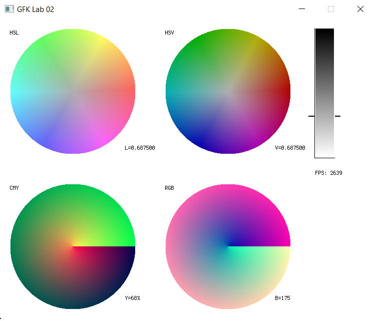

# Color_Circles

### Simple project for Computer Graphics Labs using `SFML` library.



### Instalation

1. Make folder `build` and go into it.
2. Execute

```
cmake ..
```

3. Compile:
   - `Windows`: using VS via .sln file
   - `Linux`: using make
